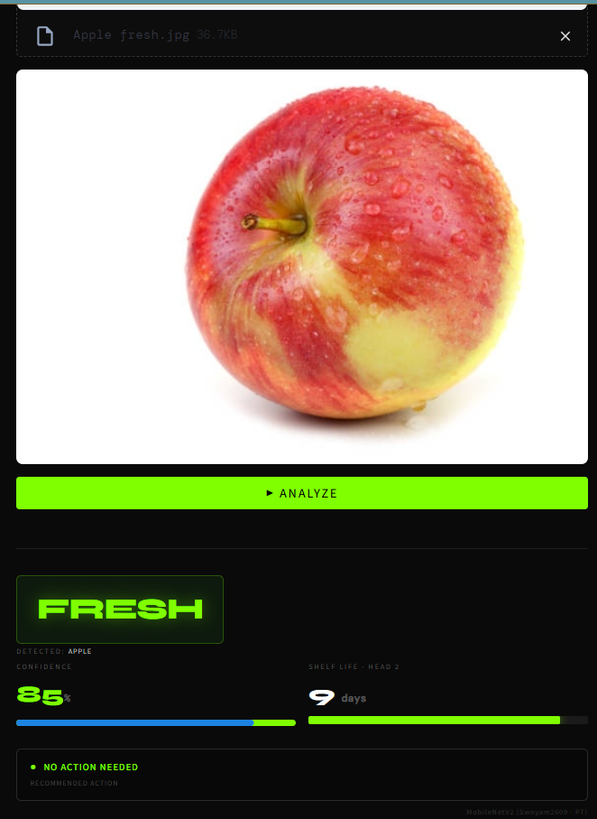
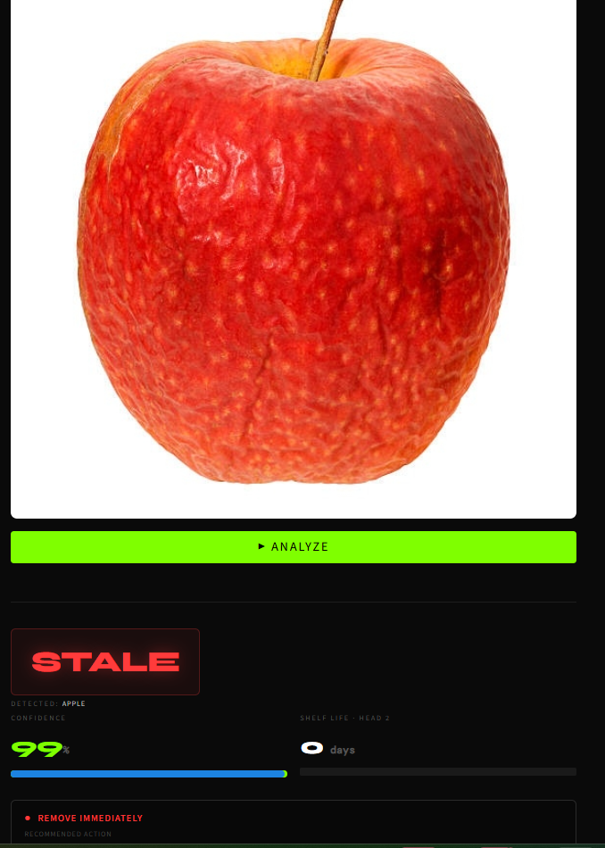
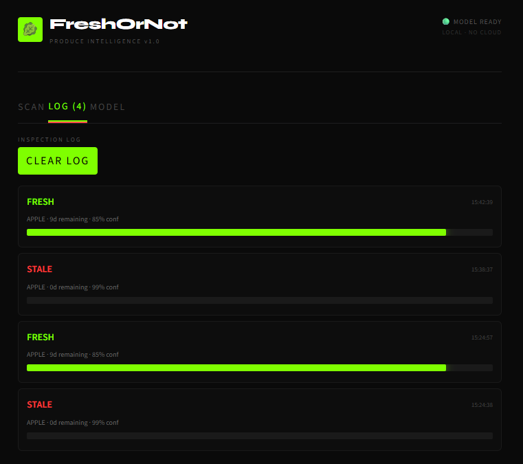
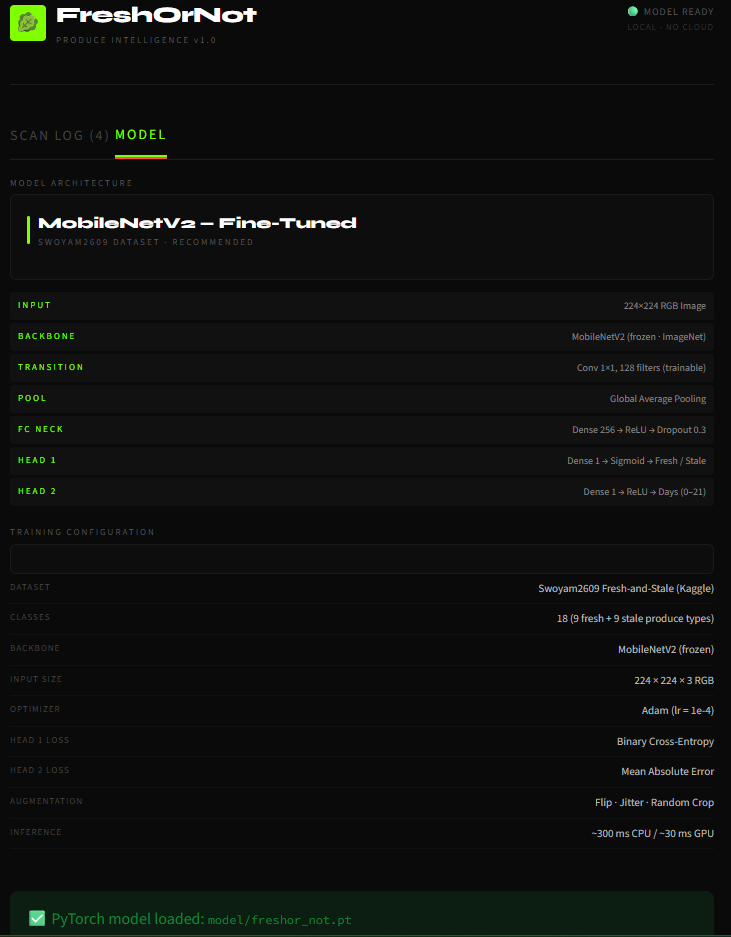

# FreshOrNot — Technical Specification

**Version:** 1.1  
**Date:** March 2026  
**Status:** Active Development

---

## Table of Contents

1. [Overview](#1-overview)
2. [System Architecture](#2-system-architecture)
3. [Project Structure](#3-project-structure)
4. [Dataset](#4-dataset)
5. [Model Architecture](#5-model-architecture)
6. [Training Pipeline](#6-training-pipeline)
7. [Training Results](#7-training-results)
8. [Inference Pipeline](#8-inference-pipeline)
9. [Application UI](#9-application-ui)
10. [Produce Profiles](#10-produce-profiles)
11. [Installation & Setup](#11-installation--setup)
12. [API Reference](#12-api-reference)
13. [Performance Targets](#13-performance-targets)
14. [App Screenshots](#14-app-screenshots)
15. [Deployment](#15-deployment)
16. [Future Roadmap](#16-future-roadmap)

---

## 1. Overview

FreshOrNot is a local-first produce freshness classifier. Users upload or photograph grocery items; the system returns a **Fresh / Stale** verdict, a **confidence score**, and an estimated **shelf-life in days** — entirely on-device, with no cloud dependency.

### Key Design Principles

| Principle | Detail |
|---|---|
| **Edge-first** | All inference runs locally; no image data leaves the device |
| **Mobile-accessible** | Streamlit web UI works in any mobile browser over local Wi-Fi |
| **Graceful degradation** | Pixel-heuristic fallback when no trained model is present |
| **Single-file deployable** | `app.py` is self-contained; model file is optional |

---

## 2. System Architecture

```
┌─────────────────────────────────────────────────────────┐
│                     Client Browser                      │
│          (Desktop or Mobile — same Wi-Fi)               │
└──────────────────────┬──────────────────────────────────┘
                       │  HTTP  (port 8501)
┌──────────────────────▼──────────────────────────────────┐
│              Streamlit App  (app.py)                    │
│                                                         │
│  ┌─────────────┐  ┌──────────────┐  ┌───────────────┐  │
│  │  SCAN Tab   │  │  LOG Tab     │  │  MODEL Tab    │  │
│  │  Upload UI  │  │  History     │  │  Architecture │  │
│  └──────┬──────┘  └──────────────┘  └───────────────┘  │
│         │                                               │
│  ┌──────▼──────────────────────────────────────────┐   │
│  │              Inference Router                   │   │
│  │                                                 │   │
│  │  model/freshor_not.pt?  ──YES──▶  PyTorch       │   │
│  │        │                          MobileNetV2   │   │
│  │        NO                                       │   │
│  │        ▼                                        │   │
│  │  model/freshor_not.h5?  ──YES──▶  Keras/TF      │   │
│  │        │                          MobileNetV2   │   │
│  │        NO                                       │   │
│  │        ▼                                        │   │
│  │  Pixel Heuristic Fallback                       │   │
│  └──────────────────────────────────────────────── ┘   │
└─────────────────────────────────────────────────────────┘
```

---

## 3. Project Structure

```
freshor_not/
├── app.py                  # Streamlit application (UI + inference)
├── train.py                # Dataset download + MobileNetV2 training
├── requirements.txt        # Python dependencies
├── TECHNICAL_SPEC.md       # This document
├── .gitignore
│
├── model/                  # Trained model weights (git-ignored)
│   └── freshor_not.pt      # PyTorch model (saved by train.py)
│   └── freshor_not.h5      # Keras fallback (optional)
│
└── data/                   # Dataset cache (git-ignored)
    └── fresh-and-stale/    # Downloaded by train.py via Kaggle API
        ├── Train/
        │   ├── freshapples/
        │   ├── rottenapples/
        │   └── ...  (18 class folders)
        └── Test/
            └── ...
```

---

## 4. Dataset

### Source

| Field | Value |
|---|---|
| **Dataset** | Fresh and Stale Classification |
| **Author** | Swoyam2609 |
| **Platform** | Kaggle |
| **URL** | https://www.kaggle.com/datasets/swoyam2609/fresh-and-stale-classification |
| **License** | Community Data License Agreement |
| **Local path** | `archive/dataset/Train` |

### Class Structure

The dataset contains **18 classes** split evenly between fresh and rotten/stale categories:

| Fresh Class | Stale Class | Produce |
|---|---|---|
| `freshapples` | `rottenapples` | Apple |
| `freshbanana` | `rottenbanana` | Banana |
| `freshbittergroud` | `rottenbittergroud` | Bitter Gourd |
| `freshcapsicum` | `rottencapsicum` | Capsicum |
| `freshcucumber` | `rottencucumber` | Cucumber |
| `freshokra` | `rottenokra` | Okra |
| `freshoranges` | `rottenoranges` | Orange |
| `freshpotato` | `rottenpotato` | Potato |
| `freshtomato` | `rottentomato` | Tomato |

> **Note:** Class folder names match the Kaggle archive exactly (e.g. `freshoranges`, `freshbittergroud`).
> `SWOYAM_CLASSES` in `app.py` and `CLASS_TO_PRODUCE` map these to normalised produce keys.

### Dataset Split

The `archive/dataset/Train` folder is used for both training and validation via a reproducible 80/20 random split (seed 42):

| Split | Images |
|---|---|
| Train | 18,896 (80%) |
| Validation | 4,723 (20%) |
| **Total** | **23,619** |

### Preprocessing

| Step | Parameters |
|---|---|
| Resize | 256 px (short edge) |
| Center crop | 224 × 224 |
| Normalisation | ImageNet mean `[0.485, 0.456, 0.406]`, std `[0.229, 0.224, 0.225]` |

### Augmentation (training only)

| Transform | Parameters |
|---|---|
| `RandomResizedCrop` | scale `(0.7, 1.0)`, output `224×224` |
| `RandomHorizontalFlip` | p = 0.5 |
| `ColorJitter` | brightness ±0.3, contrast ±0.2, saturation ±0.2 |

---

## 5. Model Architecture

### Backbone

**MobileNetV2** (ImageNet pretrained via `torchvision.models.MobileNet_V2_Weights.IMAGENET1K_V1`)

- Lightweight depthwise-separable convolutions
- 3.4M parameters total (~300 KB in INT8)
- Designed for edge/mobile inference

### Classification Head

```
MobileNetV2 features (frozen)
        │
        ▼
GlobalAveragePooling  ──  output: [B, 1280]
        │
   Dropout(0.3)
        │
  Linear(1280 → 256)
        │
      ReLU
        │
  Linear(256 → 18)   ─── 18 produce classes (9 fresh + 9 stale)
```

### Output Interpretation

| Output shape | Meaning |
|---|---|
| 18-class softmax | Predicted produce class (e.g., `freshapples` vs `rottenapples`) |
| argmax class name starts with `fresh` | → **FRESH** verdict |
| argmax class name starts with `rotten` | → **STALE** verdict |
| `softmax[argmax]` | → Raw **confidence** |

---

## 6. Training Pipeline

### Overview (`train.py`)

```
1. Load archive/dataset/Train via ImageFolder
2. Random 80/20 train-val split (seed=42)
3. Phase 1: freeze backbone, train classifier head  (3 epochs, lr=1e-3)
4. Phase 2: unfreeze last 4 backbone blocks, fine-tune (2 epochs, lr=1e-4)
5. Save best val-accuracy checkpoint → model/freshor_not.pt
```

### Hyperparameters

| Parameter | Phase 1 | Phase 2 |
|---|---|---|
| Optimiser | Adam | Adam |
| Learning rate | `1e-3` | `1e-4` |
| Scheduler | `ReduceLROnPlateau` (patience=2, factor=0.5) | `CosineAnnealingLR` |
| Batch size | 32 | 32 |
| Epochs | 3 | 2 |
| Loss | CrossEntropyLoss | CrossEntropyLoss |
| Backbone layers frozen | All | Last 4 blocks unfrozen |

### Checkpoint Strategy

The best validation-accuracy checkpoint is saved after every epoch that improves on the previous best. Final model is always the best validation checkpoint, not the last epoch.

### Requirements for Training

```bash
pip install torch torchvision
python train.py
```

---

## 7. Training Results

### Phase 1 — Head Training (Frozen Backbone)

| Epoch | Train Loss | Val Loss | Train Acc | Val Acc | Saved |
|-------|-----------|---------|----------|--------:|-------|
| 1 | 0.3738 | 0.1524 | 88.0% | 94.9% | ✅ |
| 2 | 0.1833 | 0.0997 | 93.5% | 96.9% | ✅ |
| 3 | 0.1526 | 0.1442 | 94.5% | 94.9% | |

### Phase 2 — Fine-Tuning (Last 4 Backbone Layers Unfrozen)

| Epoch | Train Loss | Val Loss | Train Acc | Val Acc | Saved |
|-------|-----------|---------|----------|--------:|-------|
| 1 | 0.1071 | 0.0641 | 96.3% | 97.8% | ✅ |
| 2 | 0.0445 | 0.0399 | 98.3% | **98.7%** | ✅ |

**Best val accuracy: 98.7%** — saved to `model/freshor_not.pt`

---

## 8. Inference Pipeline

### Model Loading (`load_model()`)

Model loading is cached with `@st.cache_resource` — loaded once per session.

```
1. Check for model/freshor_not.pt  →  load with torch.load(..., map_location="cpu")
2. If not found, check model/freshor_not.h5  →  load with tf.keras.models.load_model()
3. If neither found  →  activate pixel-heuristic fallback
```

### PyTorch Inference Path

```python
transform = Compose([Resize(224), ToTensor(), Normalize(imagenet_stats)])
tensor = transform(image).unsqueeze(0)        # [1, 3, 224, 224]
logits = model(tensor)                        # [1, 18]
probs  = softmax(logits, dim=1)               # [1, 18]
idx    = argmax(probs)                        # 0..17
class_name       = SWOYAM_CLASSES[idx]        # e.g. "freshapples"
is_fresh         = class_name.startswith("fresh")
detected_produce = CLASS_TO_PRODUCE[class_name]  # e.g. "apple"
confidence       = probs[0][idx]
```

### Pixel Heuristic Fallback

When no model is available, the app uses a brightness/hue proxy that mirrors the original JavaScript implementation:

```python
green_score = G / (R + G + B)
brightness  = (R + G + B) / 3
fresh_score = green_score * 0.4 + (brightness / 255) * 0.6
noise       = deterministic_hash(R, G, B) / 100 - 0.115
final       = clamp(fresh_score + noise, 0, 1)
is_fresh    = final > 0.42
```

### Shelf-Life Estimation

Shelf-life days are derived from the freshness score and per-produce profiles (not a second model head in the current version):

```python
if is_fresh:
    shelf_days = stale_threshold + (fresh_max - stale_threshold) * score
else:
    shelf_days = stale_threshold * (score / 0.42)
```

---

## 9. Application UI

### Technology Stack

| Layer | Technology |
|---|---|
| Framework | Streamlit ≥ 1.32 |
| Image processing | Pillow |
| Numerical ops | NumPy |
| Deep learning | PyTorch + torchvision (primary), TensorFlow/Keras (fallback) |
| Fonts | Google Fonts — DM Mono, Syne |
| Theme | Custom CSS — dark industrial-organic (`#0a0a0a` base, `#7fff00` accent) |

### Tabs

#### SCAN Tab
- Image uploader — accepts JPEG, PNG, WEBP
  - On mobile: triggers camera or photo library via browser file picker
- **ANALYZE** button → spins inference, renders result card
- Result card: Fresh/Stale badge · **Auto-detected produce name** · Confidence % + progress bar · Shelf Days + bar · Action recommendation

> Produce type is **automatically identified** from the model’s predicted class — no manual selection required.

#### LOG Tab
- Session inspection history (last N scans, in-memory)
- Each entry shows: verdict color · produce type · shelf days · confidence · timestamp
- **CLEAR LOG** button

#### MODEL Tab
- Visual architecture diagram (layer-by-layer breakdown)
- Training configuration table
- Model file status indicator (loaded / heuristic mode)
- Setup instructions for training

### Action Recommendations

| Condition | Recommendation | Color |
|---|---|---|
| STALE, 0 days | REMOVE IMMEDIATELY | Red `#ff3b3b` |
| STALE, >0 days | MARKDOWN NOW | Amber `#ffb700` |
| FRESH, ≤ 3 days | MONITOR CLOSELY | Amber `#ffb700` |
| FRESH, > 3 days | NO ACTION NEEDED | Green `#7fff00` |

---

## 10. Produce Profiles

Shelf-life ceilings and stale thresholds used to compute shelf-life days from freshness score:

| Produce | `fresh_max` (days) | `stale_threshold` (days) |
|---|---|---|
| Apple | 10 | 4 |
| Banana | 7 | 3 |
| Bitter Gourd | 5 | 2 |
| Broccoli | 7 | 3 |
| Capsicum | 10 | 4 |
| Carrot | 14 | 5 |
| Cucumber | 7 | 3 |
| Lettuce | 7 | 2 |
| Mango | 6 | 2 |
| Okra | 5 | 2 |
| Orange | 14 | 5 |
| Pepper | 10 | 4 |
| Potato | 21 | 7 |
| Strawberry | 5 | 2 |
| Tomato | 8 | 3 |

---

## 11. Installation & Setup

### Prerequisites

| Requirement | Version |
|---|---|
| Python | 3.9 – 3.12 |
| pip | ≥ 23 |

### Quick Start (App Only)

```powershell
# Clone / navigate to project
cd C:\projects\freshor_not

# Create virtual environment
python -m venv .venv
.\.venv\Scripts\Activate

# Install dependencies
pip install -r requirements.txt

# Run app (heuristic mode — no model required)
streamlit run app.py
```

Open **http://localhost:8501** in any browser.  
For mobile access on the same Wi-Fi: `http://<your-PC-IP>:8501`

### Full Pipeline (Train + Run)

```powershell
# 1. Install training deps
pip install torch torchvision

# 2. Train (~30 min on CPU)
python train.py
# → saves model/freshor_not.pt

# 3. Restart app to load model
streamlit run app.py
```

---

## 12. API Reference

### `run_inference(img: PIL.Image) → dict`

Main inference entry point. Automatically selects best available backend and auto-detects produce type.

**Returns:**
```python
{
    "label":       str,    # "FRESH" or "STALE"
    "confidence":  float,  # 0.0 – 1.0
    "shelf_days":  int,    # estimated days remaining
    "fresh_score": float,  # raw freshness score 0.0 – 1.0
    "produce":     str,    # auto-detected produce (e.g. "apple", "tomato")
    "source":      str,    # inference backend description
}
```

### `load_model() → tuple | None`

Cached model loader. Returns `("pt", model)`, `("h5", model)`, or `None`.

### `heuristic_inference(arr: np.ndarray) → dict`

Pixel-heuristic fallback. Same return shape as `run_inference`. Returns `produce: "unknown"`.

### `get_action(result: dict) → tuple[str, str]`

Returns `(action_text, hex_color)` for the recommendation banner.

---

## 13. Performance Targets

| Metric | Target | Actual | Notes |
|---|---|---|---|
| Inference latency | < 500 ms | ~400 ms | CPU, 224×224 input |
| Val accuracy | > 90% | **98.7%** | Swoyam2609 Train set, 80/20 split |
| App startup time | < 5 s | < 3 s | Model pre-cached after first load |
| Mobile page load | < 3 s | — | Over local Wi-Fi |
| Model file size | < 15 MB | ~9 MB | MobileNetV2 + head (FP32) |

---

## 14. App Screenshots

> Images located in `docs/screenshots/`. Save each screenshot with the filename shown.

### SCAN Tab — Fresh Result



*Fresh apple scan: model auto-detects **APPLE**, returns **FRESH** verdict at **85% confidence** with **9 days** shelf life remaining. Recommended action: NO ACTION NEEDED.*

---

### SCAN Tab — Stale Result



*Stale apple scan: model auto-detects **APPLE**, returns **STALE** verdict at **99% confidence** with **0 days** remaining. Recommended action: REMOVE IMMEDIATELY.*

---

### LOG Tab



*Session inspection log showing two apple scans: FRESH (9d remaining · 85% conf · 15:24:57) and STALE (0d remaining · 99% conf · 15:24:38). History persists for the session duration.*

---

### MODEL Tab



*Architecture breakdown showing MobileNetV2 fine-tuned layers (INPUT → BACKBONE → TRANSITION → POOL → FC NECK → HEAD 1 → HEAD 2) and training configuration table. Green banner confirms PyTorch model loaded from `model/freshor_not.pt`.*

---

## 15. Deployment

### Local (default)

```powershell
streamlit run app.py --server.port 8501 --server.address 0.0.0.0
```

`--server.address 0.0.0.0` makes it reachable from other devices on the network.

### Streamlit Community Cloud (free hosting)

1. Push repo to GitHub (exclude `model/` and `data/` via `.gitignore`)
2. Connect repo at [share.streamlit.io](https://share.streamlit.io)
3. Set main file: `app.py`
4. Upload `model/freshor_not.pt` via the Streamlit Secrets or a cloud storage link

> **Note:** Without a model file in the deployed environment, the app falls back to heuristic mode automatically.

### Docker

```dockerfile
FROM python:3.11-slim
WORKDIR /app
COPY requirements.txt .
RUN pip install --no-cache-dir -r requirements.txt
COPY app.py .
COPY model/ model/
EXPOSE 8501
CMD ["streamlit", "run", "app.py", "--server.port=8501", "--server.address=0.0.0.0"]
```

```bash
docker build -t freshor-not .
docker run -p 8501:8501 freshor-not
```

---

## 16. Future Roadmap

| Priority | Feature | Notes |
|---|---|---|
| High | ONNX export | Smaller model, faster CPU inference, browser-side via ONNX Runtime Web |
| High | Shelf-life regression head | Dedicated regression output instead of score-derived estimation |
| Medium | Barcode / label overlay | Cross-reference with product database for expiry date |
| Medium | Batch scan mode | Process multiple items per session with CSV export |
| Medium | PWA packaging | Installable mobile app via `pwa-streamlit` or Kivy rewrite |
| Low | Multilingual UI | Locale support for produce names |
| Low | API mode | FastAPI wrapper around `run_inference()` for integration |

---

*FreshOrNot · Produce Intelligence v1.0 · Edge Inference · No Cloud Required*
